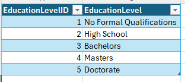
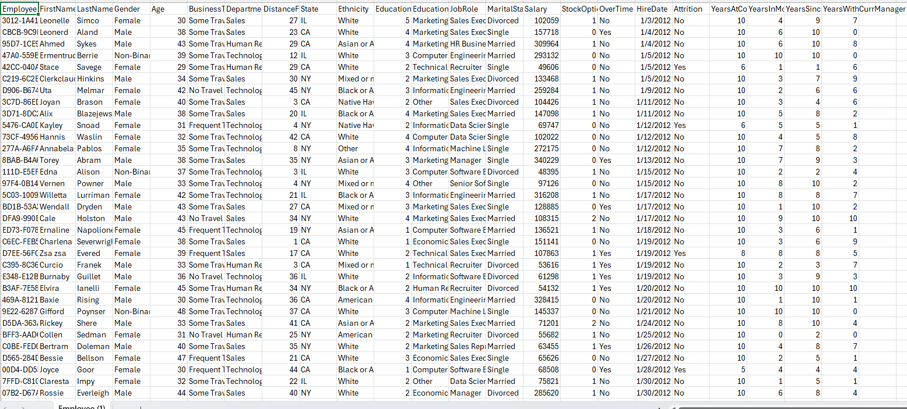
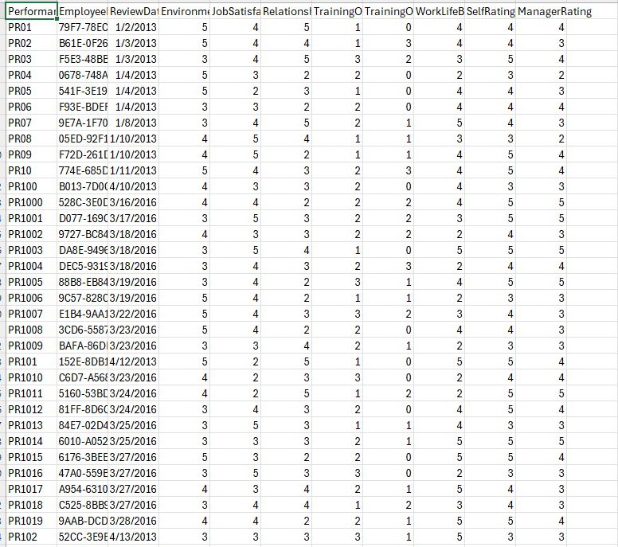
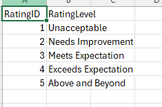
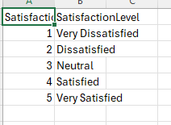

# Data Preparation

## Data Examination

In the initial phase of the project, I examined the original data files, which were provided in various formats (e.g., CSV, Excel). Below is a summary of the key tables and their fields:

### Employee Table
Contains detailed information about employees, including their performance, satisfaction levels, and other relevant metrics.

- **`PerformanceID`**: Unique identifier for each performance review.
- **`EmployeeID`**: Unique identifier for each employee.
- **`ReviewId`**: Identifier for the review period.
- **`EnvironmentalSatisfaction`**: Employee's satisfaction with the work environment (1-5 scale).
- **`JobSatisfaction`**: Employee's satisfaction with their job (1-5 scale).
- **`RelationshipsSatisfaction`**: Employee's satisfaction with workplace relationships (1-5 scale).
- **`TrainingOpportunitiesWithInYear`**: Number of training opportunities within the year.
- **`TrainingOpportunitiesTakeon`**: Number of training opportunities taken.
- **`WorkLifeBalance`**: Employee's work-life balance rating (1-5 scale).
- **`SelfRating`**: Employee's self-rating of performance (1-5 scale).
- **`ManageRatings`**: Manager's rating of the employee's performance (1-5 scale).

### EducationLevel Table
Contains information about the education levels of employees.

- **`EducationLevelID`**: Unique identifier for each education level.
- **`EducationLevel`**: Description of the education level (e.g., *High School*, *Bachelors*, *Masters*).

### PerformanceRating Table
Contains performance ratings for employees.

- **`RatingID`**: Unique identifier for each rating level.
- **`RatingLevel`**: Description of the rating level (e.g., *Unacceptable*, *Meets Expectation*, *Exceeds Expectation*).

### SatisfiedLevel Table
Contains satisfaction levels for employees.

- **`SatisfactionID`**: Unique identifier for each satisfaction level.
- **`SatisfactionLevel`**: Description of the satisfaction level (e.g., *Very Dissatisfied*, *Neutral*, *Very Satisfied*).

---

## Data Transformation

To prepare the data for efficient analysis, I took the following transformation steps:

1. **Standardize Ratings**:  
   - Ensured all ratings (e.g., `EnvironmentalSatisfaction`, `JobSatisfaction`) are on a consistent 1-5 scale across all tables.

2. **Handle Missing Values**:  
   - Identified and addressed any missing or null values in the dataset. For example, in the Employee table, I checked for missing values in columns like `SelfRating` and `ManageRatings` and filled them appropriately.

3. **Data Validation**:  
   - Cross-referenced `EmployeeID` and `ReviewId` to ensure consistency across related tables. For instance, I verified that each `EmployeeID` in the Employee table corresponds to a valid entry in the `PerformanceRating` and `SatisfiedLevel` tables.

4. **Data Enrichment**:  
   - Added additional columns for analysis, such as overall satisfaction scores derived from individual satisfaction metrics (e.g., averaging `EnvironmentalSatisfaction`, `JobSatisfaction`, and `RelationshipsSatisfaction` to create an `OverallSatisfaction` score).

5. **Create Mapping Dictionaries**:  
   - Created dictionaries to map IDs to descriptive labels for easier interpretation. For example, I mapped `RatingID` to `RatingLevel` in the `PerformanceRating` table and `SatisfactionID` to `SatisfactionLevel` in the `SatisfiedLevel` table.

6. **Replace Full Names with IDs**:  
   - In cases where full names or descriptions were used, I replaced them with corresponding IDs to standardize the data and improve query performance. For example, I replaced `EducationLevel` descriptions with `EducationLevelID` in the Employee table.

7. **Save the Updated Data**:  
   - Finally, I saved the updated data in the respective tables, ensuring they were properly prepared and optimized for the next phases of the project.
   
---

## Employee Table: Data Preparation

The Employee table is a central component of the dataset, containing detailed information about employees. Below is a summary of the key steps taken to prepare this table:

1. **Standardize Ratings**:  
   - All satisfaction and performance ratings were standardized to a 1-5 scale for consistency.

2. **Handle Missing Values**:  
   - Missing values in columns like `SelfRating` and `ManageRatings` were addressed by either filling them with median values or removing incomplete records.

3. **Data Validation**:  
   - Cross-referenced `EmployeeID` and `ReviewId` with other tables to ensure data integrity.

4. **Data Enrichment**:  
   - Added an `OverallSatisfaction` score by averaging individual satisfaction metrics.

5. **Save the Updated Data**:  
   - The cleaned and transformed Employee table was saved for further analysis.

