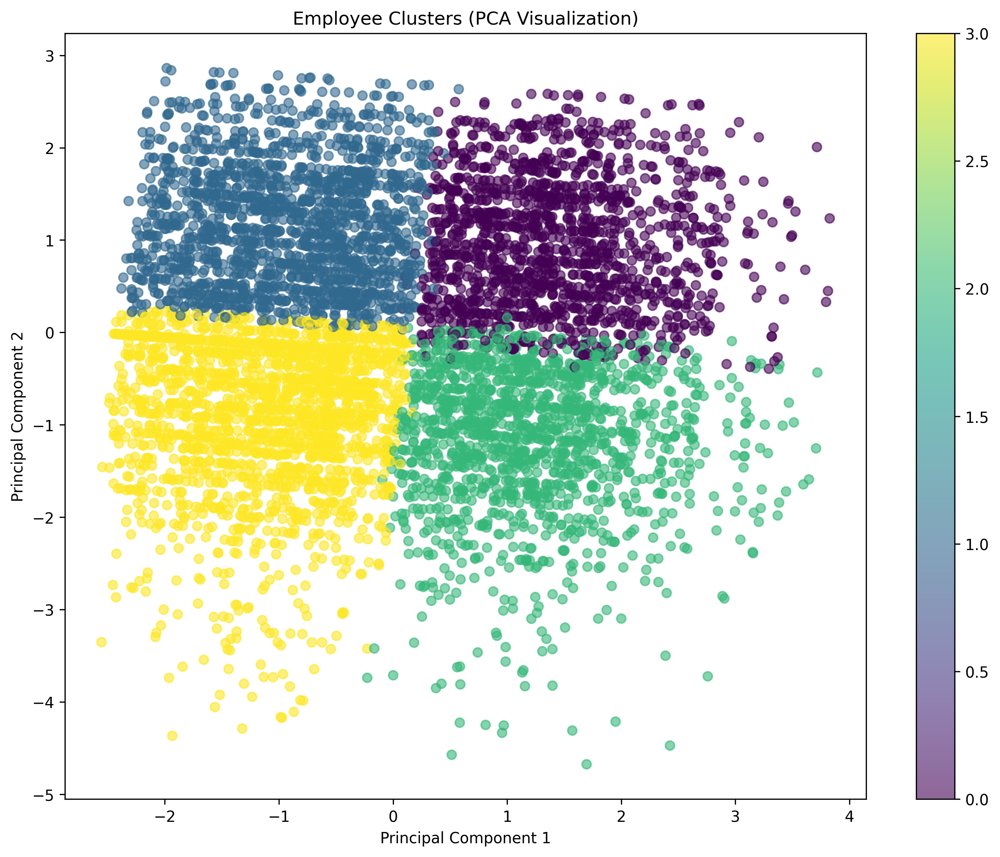
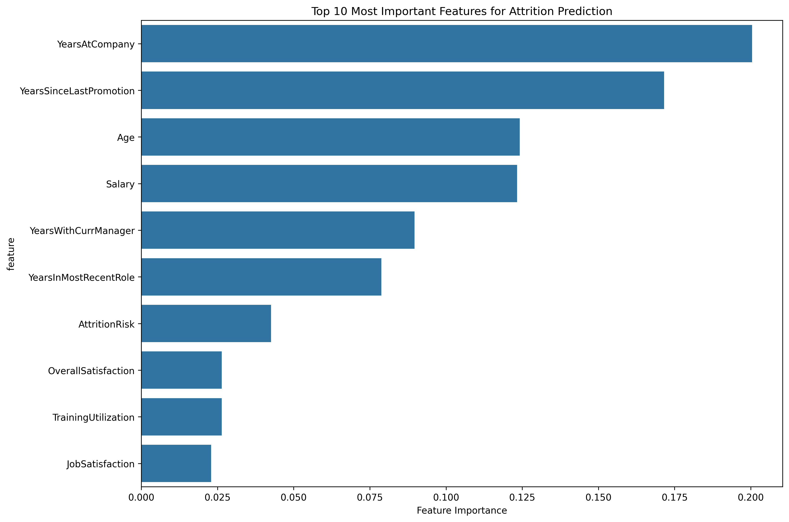
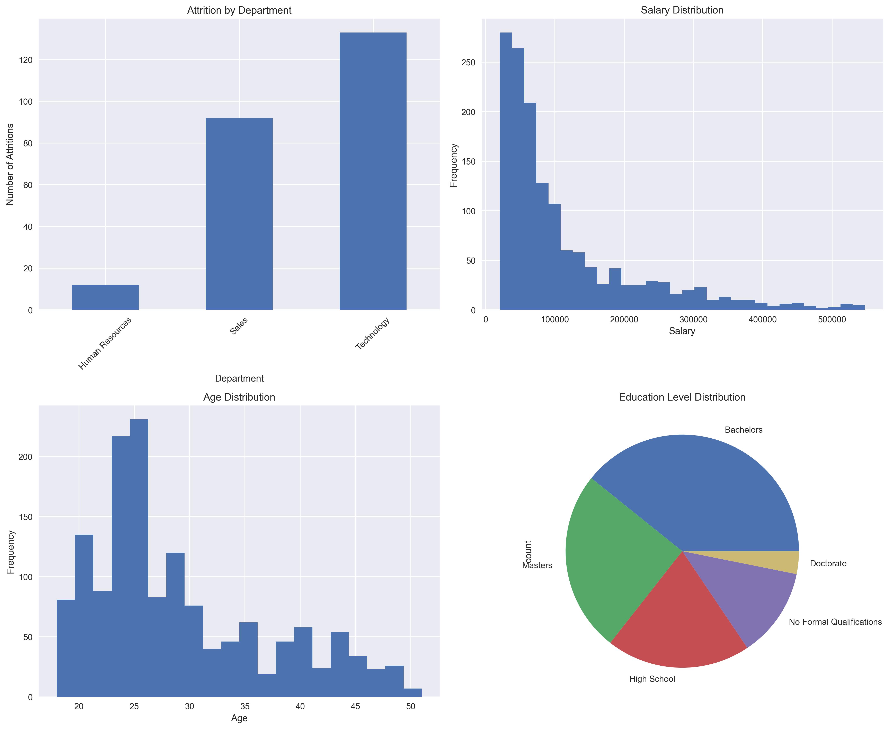

# HR Analytics Data Processing for Power BI

This project provides comprehensive Python scripts for preprocessing HR analytics data before importing into Power BI. The scripts handle data cleaning, feature engineering, advanced analytics, and machine learning predictions.

## 📁 Files Overview

### Core Scripts
- `hr_analytics_preprocessing.py` - Main data preprocessing pipeline
- `hr_advanced_analytics.py` - Advanced analytics and machine learning
- `requirements.txt` - Python dependencies

### Input Data (CSV Files)
- `Employee.csv` - Employee demographic and employment data
- `EducationLevel.csv` - Education level reference data
- `PerformanceRating.csv` - Performance and satisfaction ratings
- `RatingLevel.csv` - Rating level reference data
- `SatisfiedLevel.csv` - Satisfaction level reference data

## 🚀 Quick Start

### 1. Install Dependencies
```bash
pip install -r requirements.txt
```

### 2. Run Data Preprocessing
```bash
python hr_analytics_preprocessing.py
```

### 3. Run Advanced Analytics (Optional)
```bash
python hr_advanced_analytics.py
```

## 📊 What Each Script Does

### hr_analytics_preprocessing.py
**Data Cleaning & Feature Engineering:**
- Loads and validates all CSV files
- Removes duplicates and handles missing values
- Converts data types (dates, numbers)
- Merges all datasets into one comprehensive table
- Creates new features:
  - Age groups
  - Salary ranges
  - Performance scores
  - Overall satisfaction scores
  - Training utilization rates
  - Tenure categories
  - Performance categories
  - Attrition risk scores

[Click here to open the Python file](file/hr_analytics_preprocessing.py)

**Outputs:**
- `hr_analytics_processed.csv` - Main dataset for Power BI
- `employee_cleaned.csv` - Cleaned employee data
- `performance_cleaned.csv` - Cleaned performance data
- `department_summary.csv` - Department aggregations
- `education_summary.csv` - Education level analysis
- `age_summary.csv` - Age group analysis
- `performance_trends.csv` - Performance trends over time
- `hr_analytics_overview.png` - Basic visualizations
- `data_processing_report.txt` - Processing summary

### hr_advanced_analytics.py
**Machine Learning & Advanced Analytics:**
- Attrition prediction using multiple ML models
- Employee clustering analysis
- Feature importance analysis
- Risk scoring for employee retention
- Advanced business insights

**Outputs:**
- `attrition_predictions.csv` - Individual attrition predictions
- `employee_clusters.csv` - Employee cluster assignments
- `high_risk_employees.csv` - High-risk employee list
- `feature_importance.png` - Feature importance visualization
- `employee_clusters.png` - Cluster visualization
- `ml_analysis_report.txt` - ML analysis summary

## 📈 Power BI Integration

### Main Dataset
Import `hr_analytics_processed.csv` as your primary dataset in Power BI. This contains:
- All employee information
- Performance metrics
- Satisfaction scores
- Calculated features
- Risk scores

### Supporting Tables
Import the summary tables for dashboard aggregations:
- `department_summary.csv`
- `education_summary.csv`
- `age_summary.csv`
- `performance_trends.csv`

### ML Results (Optional)
For predictive analytics in Power BI:
- `attrition_predictions.csv` - Individual risk scores
- `employee_clusters.csv` - Employee segments
- `high_risk_employees.csv` - Focus list for HR actions

## 🔧 Key Features Created

### Demographic Features
- Age groups (Under 30, 30-40, 40-50, Over 50)
- Salary ranges (Low, Below Average, Average, Above Average, High)
- Tenure categories (New, Early Career, Mid Career, Long Term)

### Performance Features
- Performance score (average of self and manager ratings)
- Performance categories (Needs Improvement, Meets Expectations, Exceeds Expectations, Outstanding)
- Overall satisfaction score (average of job, environment, and relationship satisfaction)

### Risk & Predictive Features
- Attrition risk score (weighted combination of satisfaction and tenure factors)
- Training utilization rate (training taken vs. training offered)
- Attrition probability (ML model prediction)
- Risk categories (Very Low, Low, Medium, High, Very High)

## 📋 Data Quality Improvements

The preprocessing pipeline handles:
- **Missing Values**: Filled with appropriate defaults or medians
- **Data Types**: Proper conversion of dates, numbers, and categories
- **Duplicates**: Removal of duplicate records
- **Outliers**: Identification and handling of extreme values
- **Consistency**: Standardized formats across all datasets

## 🎯 Business Use Cases

### HR Dashboard
- Employee demographics and distribution
- Performance trends and comparisons
- Satisfaction analysis by department
- Attrition monitoring and prevention

### Predictive Analytics
- Identify employees at risk of leaving
- Predict performance based on satisfaction
- Segment employees for targeted interventions
- Optimize training and development programs

### Strategic Insights
- Department health scores
- Salary equity analysis
- Training effectiveness
- Retention strategy optimization

## 🛠️ Troubleshooting

### Common Issues
1. **Missing CSV files**: Ensure all 5 CSV files are in the same directory as the scripts
2. **Python dependencies**: Install all packages from `requirements.txt`
3. **Memory issues**: For large datasets, consider processing in chunks
4. **Visualization errors**: The script will fall back to default matplotlib style if seaborn is not available

### Error Messages
- **"File not found"**: Check that CSV files are in the correct location
- **"Module not found"**: Install missing packages with `pip install package_name`
- **"Memory error"**: Reduce dataset size or process in smaller batches

## 📞 Support

If you encounter issues:
1. Check that all CSV files are present and properly formatted
2. Verify Python version (3.7+ recommended)
3. Ensure all dependencies are installed
4. Check the console output for specific error messages

## 🔄 Workflow

1. **Data Preparation**: Place all CSV files in the project directory
2. **Preprocessing**: Run `hr_analytics_preprocessing.py`
3. **Advanced Analytics**: Run `hr_advanced_analytics.py` (optional)
4. **Power BI Import**: Import the generated CSV files into Power BI
5. **Dashboard Creation**: Build visualizations using the processed data

This pipeline ensures your HR data is clean, enriched, and ready for powerful analytics in Power BI! 




