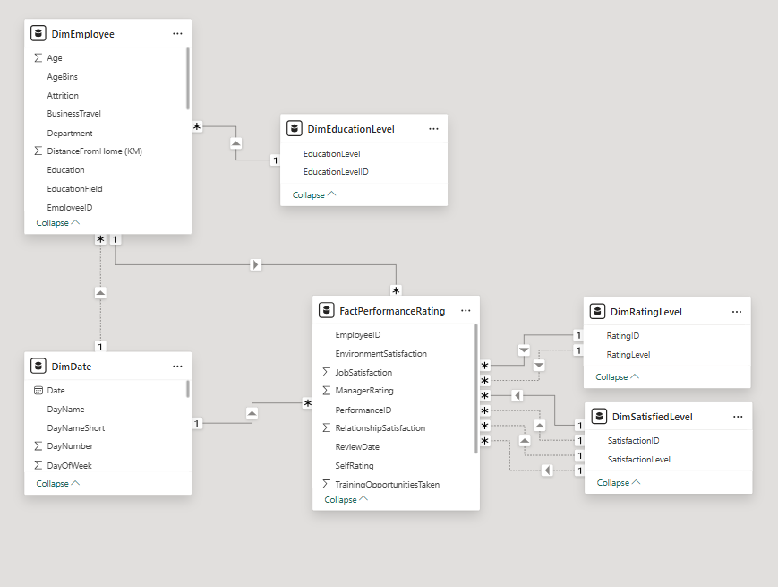

# Data Modeling Documentation

## Star Schema Structure
This HR analytics project implements a star schema design to optimize performance rating analysis, with `FactPerformanceRating` as the central fact table connected to five dimension tables.

---

## Fact Table
### `FactPerformanceRating`
Tracks employee performance metrics with foreign keys linking to dimension tables.

- **EmployeeID**: Primary key (PK) linking to `DimEmployee`
- **PerformanceID**: Unique identifier for each review
- **ReviewDate**: FK → `DimDate` (date of evaluation)
- **EnvironmentSatisfaction**: FK → `DimSatisfiedLevel` (1-5 scale)
- **JobSatisfaction**: FK → `DimSatisfiedLevel`
- **RelationshipSatisfaction**: FK → `DimSatisfiedLevel`
- **SelfRating**: FK → `DimRatingLevel` (employee self-assessment)
- **ManageRating**: FK → `DimRatingLevel` (manager evaluation)
- **TrainingOpportunitiesTaken**: Count of completed trainings

**Relationships**: Many-to-one with all dimension tables

---

## Dimension Tables

### 1. `DimEmployee`
Master employee demographics table.

- **EmployeeID**: PK uniquely identifying employees
- **Department**: Technology/Sales/HR
- **Education**: FK → `DimEducationLevel`
- **AgeBins**: Categorical age groups
- **Attrition**: Employment status (Yes/No)
- **BusinessTravel**: Frequency categories
- **DistanceFromHome (KM)**: Commute distance

**Primary Key**: `EmployeeID`

### 2. `DimEducationLevel`
Education reference table.

- **EducationLevelID**: PK
- **EducationLevel**: High School/Bachelors/Masters/etc.

### 3. `DimDate`
Time dimension for analysis.

- **Date**: PK (YYYY-MM-DD)
- **DayName**: Weekday names
- **DayOfWeek**: Numerical weekday

### 4. `DimRatingLevel`
Performance rating scale.

- **RatingID**: PK
- **RatingLevel**: "Unacceptable" to "Exceeds Expectation"

### 5. `DimSatisfiedLevel`
Satisfaction scale reference.

- **SatisfactionID**: PK
- **SatisfactionLevel**: "Very Dissatisfied" to "Very Satisfied"

---

