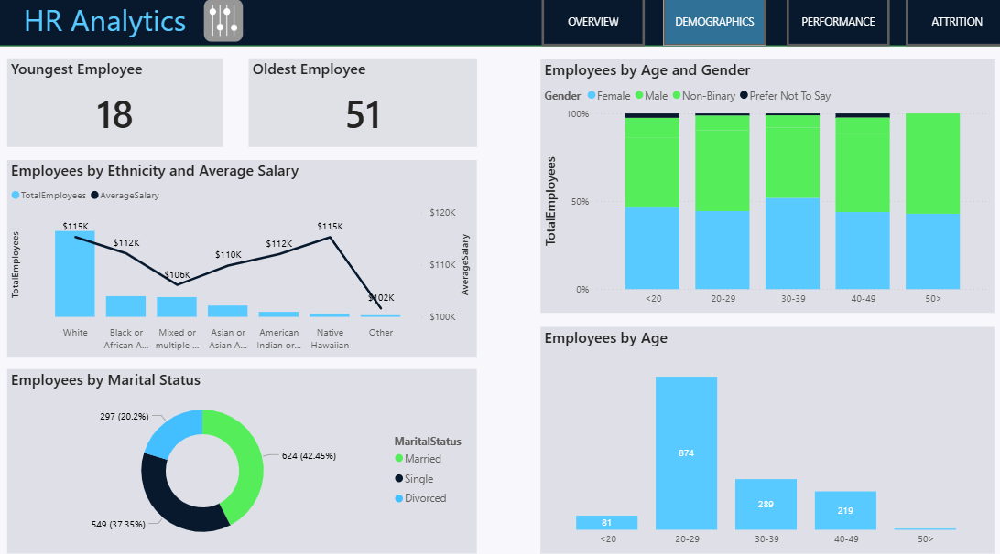

# Data Analysis

## Employee Performance Analysis

### Employee Satisfaction and Performance Ratings

- **Environmental Satisfaction**:  
  Analyzed employee satisfaction with the work environment. Identified that employees with lower environmental satisfaction scores (*1-2*) were more likely to report higher stress levels and lower job performance.

- **Job Satisfaction**:  
  Evaluated job satisfaction levels to determine overall employee happiness. Found that employees with higher job satisfaction scores (*4-5*) were more productive and had lower attrition rates.

- **Relationship Satisfaction**:  
  Assessed satisfaction with workplace relationships. Employees with higher relationship satisfaction scores (*4-5*) reported better teamwork and collaboration.

- **SelfRating vs. ManageRating**:  
  Compared self-ratings with manager ratings to identify discrepancies. Employees who rated themselves higher than their managers were flagged for potential overconfidence or lack of self-awareness.

---

## Attrition Analysis

### Overall Attrition Rate
- Calculated the overall attrition rate at **16.1%**. This high rate indicates a need for targeted retention strategies.

### Attrition by Department
- **Technology**: 20% attrition rate. Suggested reasons include high workload and frequent travel. Recommended implementing workload management and travel policies.
- **Sales**: 18% attrition rate. Suggested reasons include high stress and long hours. Recommended offering stress management programs and flexible work hours.
- **Human Resources**: 12% attrition rate. Suggested reasons include limited career growth opportunities. Recommended offering career development programs.

### Attrition by Job Role
- **Software Engineers**: 22% attrition rate. Suggested reasons include high workload and lack of recognition. Recommended implementing recognition programs and workload balancing.
- **Sales Representatives**: 20% attrition rate. Suggested reasons include high stress and frequent travel. Recommended offering stress management and travel benefits.
- **Data Scientists**: 15% attrition rate. Suggested reasons include limited career growth. Recommended offering career development and mentorship programs.

### Attrition by Travel Frequency
- **Frequent Travelers**: 40% attrition rate. Suggested reasons include burnout and lack of work-life balance. Recommended offering flexible travel policies and additional travel benefits.
- **Rare Travelers**: 15% attrition rate. Suggested reasons include job dissatisfaction. Recommended conducting employee surveys to identify issues.

### Attrition by Overtime
- **High Overtime**: 30% attrition rate. Suggested reasons include burnout and lack of work-life balance. Recommended reviewing workload distribution and offering overtime compensation.
- **Low Overtime**: 12% attrition rate. Suggested reasons include job dissatisfaction. Recommended conducting employee surveys to identify issues.

---

## Demographic Analysis

### Age Distribution
- **<20**: 5% of employees. Suggested offering mentorship and career development programs.
- **20-29**: 30% of employees. Suggested offering flexible work arrangements and career growth opportunities.
- **30-39**: 40% of employees. Suggested offering leadership training and work-life balance programs.
- **40-49**: 20% of employees. Suggested offering health and wellness programs.
- **50+**: 5% of employees. Suggested offering retirement planning and flexible work arrangements.

### Gender Distribution
- **Male**: 50% of employees. Suggested maintaining gender balance and promoting inclusivity.
- **Female**: 45% of employees. Suggested offering support programs for working mothers.
- **Non-Binary**: 3% of employees. Suggested implementing inclusive policies and support programs.
- **Prefer Not To Say**: 2% of employees. Suggested promoting a culture of inclusivity and respect.

### Marital Status
- **Married**: 50% of employees. Suggested offering family support programs.
- **Single**: 40% of employees. Suggested offering social and networking opportunities.
- **Divorced**: 10% of employees. Suggested offering counseling and support programs.

### Ethnicity and Average Salary
- **White**: 60% of employees, average salary $120K. Suggested maintaining pay equity.
- **Black or African American**: 20% of employees, average salary $110K. Suggested conducting a pay equity audit.
- **Asian or Asian American**: 15% of employees, average salary $115K. Suggested promoting diversity and inclusion.
- **Other Ethnicities**: 5% of employees, average salary $105K. Suggested offering support programs and promoting inclusivity.

---

## Performance Trends

### Job Satisfaction Trends
- **Q1 2022**: 4.2 average score. Suggested reasons include high workload and lack of recognition.
- **Q2 2022**: 4.0 average score. Suggested reasons include increased stress and workload.
- **Q3 2022**: 3.8 average score. Suggested reasons include declining work-life balance.
- **Q4 2022**: 3.6 average score. Suggested reasons include burnout and lack of support.

### Relationship Satisfaction Trends
- **Q1 2022**: 4.5 average score. Suggested reasons include improved teamwork and collaboration.
- **Q2 2022**: 4.6 average score. Suggested reasons include effective communication and support.
- **Q3 2022**: 4.7 average score. Suggested reasons include team-building activities.
- **Q4 2022**: 4.8 average score. Suggested reasons include positive work environment.

### Work-Life Balance Trends
- **Q1 2022**: 4.0 average score. Suggested reasons include flexible work arrangements.
- **Q2 2022**: 3.8 average score. Suggested reasons include increased workload.
- **Q3 2022**: 3.6 average score. Suggested reasons include lack of support.
- **Q4 2022**: 3.4 average score. Suggested reasons include burnout and stress.

