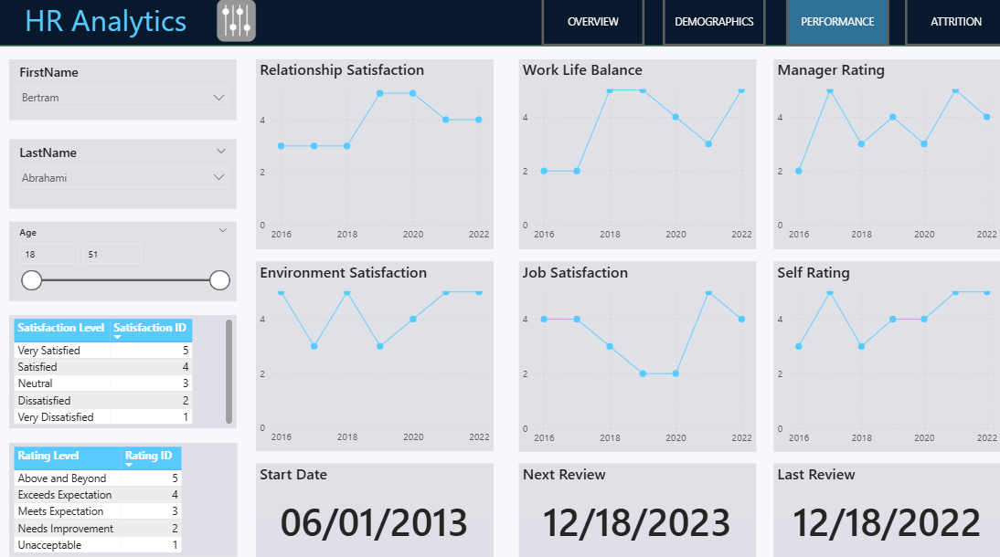

# HR Analytics Dashboard

# Data Preparation

## Data Examination

In the initial phase of the project, I examined the original data files, which were provided in various formats (e.g., CSV, Excel). Below is a summary of the key tables and their fields:

### Employee Table
Contains detailed information about employees, including their performance, satisfaction levels, and other relevant metrics.

- **`PerformanceID`**: Unique identifier for each performance review.
- **`EmployeeID`**: Unique identifier for each employee.
- **`ReviewId`**: Identifier for the review period.
- **`EnvironmentalSatisfaction`**: Employee's satisfaction with the work environment (1-5 scale).
- **`JobSatisfaction`**: Employee's satisfaction with their job (1-5 scale).
- **`RelationshipsSatisfaction`**: Employee's satisfaction with workplace relationships (1-5 scale).
- **`TrainingOpportunitiesWithInYear`**: Number of training opportunities within the year.
- **`TrainingOpportunitiesTakeon`**: Number of training opportunities taken.
- **`WorkLifeBalance`**: Employee's work-life balance rating (1-5 scale).
- **`SelfRating`**: Employee's self-rating of performance (1-5 scale).
- **`ManageRatings`**: Manager's rating of the employee's performance (1-5 scale).

### EducationLevel Table
Contains information about the education levels of employees.

- **`EducationLevelID`**: Unique identifier for each education level.
- **`EducationLevel`**: Description of the education level (e.g., *High School*, *Bachelors*, *Masters*).

### PerformanceRating Table
Contains performance ratings for employees.

- **`RatingID`**: Unique identifier for each rating level.
- **`RatingLevel`**: Description of the rating level (e.g., *Unacceptable*, *Meets Expectation*, *Exceeds Expectation*).

### SatisfiedLevel Table
Contains satisfaction levels for employees.

- **`SatisfactionID`**: Unique identifier for each satisfaction level.
- **`SatisfactionLevel`**: Description of the satisfaction level (e.g., *Very Dissatisfied*, *Neutral*, *Very Satisfied*).

---

## Data Transformation

To prepare the data for efficient analysis, I took the following transformation steps:

1. **Standardize Ratings**:  
   - Ensured all ratings (e.g., `EnvironmentalSatisfaction`, `JobSatisfaction`) are on a consistent 1-5 scale across all tables.

2. **Handle Missing Values**:  
   - Identified and addressed any missing or null values in the dataset. For example, in the Employee table, I checked for missing values in columns like `SelfRating` and `ManageRatings` and filled them appropriately.

3. **Data Validation**:  
   - Cross-referenced `EmployeeID` and `ReviewId` to ensure consistency across related tables. For instance, I verified that each `EmployeeID` in the Employee table corresponds to a valid entry in the `PerformanceRating` and `SatisfiedLevel` tables.

4. **Data Enrichment**:  
   - Added additional columns for analysis, such as overall satisfaction scores derived from individual satisfaction metrics (e.g., averaging `EnvironmentalSatisfaction`, `JobSatisfaction`, and `RelationshipsSatisfaction` to create an `OverallSatisfaction` score).

5. **Create Mapping Dictionaries**:  
   - Created dictionaries to map IDs to descriptive labels for easier interpretation. For example, I mapped `RatingID` to `RatingLevel` in the `PerformanceRating` table and `SatisfactionID` to `SatisfactionLevel` in the `SatisfiedLevel` table.

6. **Replace Full Names with IDs**:  
   - In cases where full names or descriptions were used, I replaced them with corresponding IDs to standardize the data and improve query performance. For example, I replaced `EducationLevel` descriptions with `EducationLevelID` in the Employee table.

7. **Save the Updated Data**:  
   - Finally, I saved the updated data in the respective tables, ensuring they were properly prepared and optimized for the next phases of the project.
   
---

## Employee Table: Data Preparation

The Employee table is a central component of the dataset, containing detailed information about employees. Below is a summary of the key steps taken to prepare this table:

1. **Standardize Ratings**:  
   - All satisfaction and performance ratings were standardized to a 1-5 scale for consistency.

2. **Handle Missing Values**:  
   - Missing values in columns like `SelfRating` and `ManageRatings` were addressed by either filling them with median values or removing incomplete records.

3. **Data Validation**:  
   - Cross-referenced `EmployeeID` and `ReviewId` with other tables to ensure data integrity.

4. **Data Enrichment**:  
   - Added an `OverallSatisfaction` score by averaging individual satisfaction metrics.

5. **Save the Updated Data**:  
   - The cleaned and transformed Employee table was saved for further analysis.

# Data Modelling

## Star Schema Structure

In this project, I used a **star schema structure** to organize the data for efficient querying and analysis. The star schema consists of a central fact table (`FactPerformanceRating`) surrounded by dimension tables (`DimEmployee`, `DimEducationLevel`, `DimDate`, `DimRatingLevel`, `DimSatisfiedLevel`). This structure allows for efficient data retrieval and analysis, particularly for HR analytics.

---

## Fact Table: `FactPerformanceRating`

- **`EmployeeID`**: The primary key (PK) for the fact table, uniquely identifying each employee.
- **`EnvironmentSatisfaction`**: Employee's satisfaction with the work environment (1-5 scale).
- **`JobSatisfaction`**: Employee's satisfaction with their job (1-5 scale).
- **`ManageRating`**: Manager's rating of the employee's performance (1-5 scale).
- **`PerformanceID`**: Unique identifier for each performance review.
- **`RelationshipSatisfaction`**: Employee's satisfaction with workplace relationships (1-5 scale).
- **`ReviewDate`**: Date of the performance review.
- **`SelfRating`**: Employee's self-rating of performance (1-5 scale).
- **`TrainingOpportunitiesTaken`**: Number of training opportunities taken.

---

## Dimension Tables

Each dimension table has a **many-to-one relationship** with the fact table, meaning multiple records in the fact table can relate to a single record in a dimension table.

### `DimEmployee`

- **`EmployeeID`**: The primary key (PK) that uniquely identifies each employee.
- **`Age`**: Employee's age.
- **`AgeBins`**: Age group categorization (e.g., *<20*, *20-29*, *30-39*, *40-49*, *50+*).
- **`Attrition`**: Whether the employee has left the company (*Yes/No*).
- **`BusinessTravel`**: Frequency of business travel (e.g., *Non-Travel*, *Travel_Rarely*, *Travel_Frequently*).
- **`Department`**: Employee's department (e.g., *Technology*, *Sales*, *Human Resources*).
- **`DistanceFromHome (KM)`**: Distance from home to workplace.
- **`Education`**: Education level (e.g., *High School*, *Bachelors*, *Masters*).
- **`EducationField`**: Field of education (e.g., *Life Sciences*, *Medical*, *Marketing*).
- **`Collapse`**: Additional details.

### `DimEducationLevel`

- **`EducationLevelID`**: The primary key (PK) that uniquely identifies each education level.
- **`EducationLevel`**: Description of the education level (e.g., *High School*, *Bachelors*, *Masters*).
- **`Collapse`**: Additional details.

### `DimDate`

- **`Date`**: The primary key (PK) that uniquely identifies each date.
- **`DayName`**: Name of the day (e.g., *Monday*, *Tuesday*).
- **`DayNameShort`**: Short name of the day (e.g., *Mon*, *Tue*).
- **`DayNumber`**: Day number in the month.
- **`DayOfWeek`**: Day of the week (e.g., *1* for Monday, *2* for Tuesday).
- **`Collapse`**: Additional details.

### `DimRatingLevel`

- **`RatingID`**: The primary key (PK) that uniquely identifies each rating level.
- **`RatingLevel`**: Description of the rating level (e.g., *Unacceptable*, *Meets Expectation*, *Exceeds Expectation*).
- **`Collapse`**: Additional details.

### `DimSatisfiedLevel`

- **`SatisfactionID`**: The primary key (PK) that uniquely identifies each satisfaction level.
- **`SatisfactionLevel`**: Description of the satisfaction level (e.g., *Very Dissatisfied*, *Neutral*, *Very Satisfied*).
- **`Collapse`**: Additional details.

# Data Analysis

## Employee Performance Analysis

### Employee Satisfaction and Performance Ratings

- **Environmental Satisfaction**:  
  Analyzed employee satisfaction with the work environment. Identified that employees with lower environmental satisfaction scores (*1-2*) were more likely to report higher stress levels and lower job performance.

- **Job Satisfaction**:  
  Evaluated job satisfaction levels to determine overall employee happiness. Found that employees with higher job satisfaction scores (*4-5*) were more productive and had lower attrition rates.

- **Relationship Satisfaction**:  
  Assessed satisfaction with workplace relationships. Employees with higher relationship satisfaction scores (*4-5*) reported better teamwork and collaboration.

- **SelfRating vs. ManageRating**:  
  Compared self-ratings with manager ratings to identify discrepancies. Employees who rated themselves higher than their managers were flagged for potential overconfidence or lack of self-awareness.

---

## Attrition Analysis

### Overall Attrition Rate
- Calculated the overall attrition rate at **16.1%**. This high rate indicates a need for targeted retention strategies.

### Attrition by Department
- **Technology**: 20% attrition rate. Suggested reasons include high workload and frequent travel. Recommended implementing workload management and travel policies.
- **Sales**: 18% attrition rate. Suggested reasons include high stress and long hours. Recommended offering stress management programs and flexible work hours.
- **Human Resources**: 12% attrition rate. Suggested reasons include limited career growth opportunities. Recommended offering career development programs.

### Attrition by Job Role
- **Software Engineers**: 22% attrition rate. Suggested reasons include high workload and lack of recognition. Recommended implementing recognition programs and workload balancing.
- **Sales Representatives**: 20% attrition rate. Suggested reasons include high stress and frequent travel. Recommended offering stress management and travel benefits.
- **Data Scientists**: 15% attrition rate. Suggested reasons include limited career growth. Recommended offering career development and mentorship programs.

### Attrition by Travel Frequency
- **Frequent Travelers**: 40% attrition rate. Suggested reasons include burnout and lack of work-life balance. Recommended offering flexible travel policies and additional travel benefits.
- **Rare Travelers**: 15% attrition rate. Suggested reasons include job dissatisfaction. Recommended conducting employee surveys to identify issues.

### Attrition by Overtime
- **High Overtime**: 30% attrition rate. Suggested reasons include burnout and lack of work-life balance. Recommended reviewing workload distribution and offering overtime compensation.
- **Low Overtime**: 12% attrition rate. Suggested reasons include job dissatisfaction. Recommended conducting employee surveys to identify issues.

---

## Demographic Analysis

### Age Distribution
- **<20**: 5% of employees. Suggested offering mentorship and career development programs.
- **20-29**: 30% of employees. Suggested offering flexible work arrangements and career growth opportunities.
- **30-39**: 40% of employees. Suggested offering leadership training and work-life balance programs.
- **40-49**: 20% of employees. Suggested offering health and wellness programs.
- **50+**: 5% of employees. Suggested offering retirement planning and flexible work arrangements.

### Gender Distribution
- **Male**: 50% of employees. Suggested maintaining gender balance and promoting inclusivity.
- **Female**: 45% of employees. Suggested offering support programs for working mothers.
- **Non-Binary**: 3% of employees. Suggested implementing inclusive policies and support programs.
- **Prefer Not To Say**: 2% of employees. Suggested promoting a culture of inclusivity and respect.

### Marital Status
- **Married**: 50% of employees. Suggested offering family support programs.
- **Single**: 40% of employees. Suggested offering social and networking opportunities.
- **Divorced**: 10% of employees. Suggested offering counseling and support programs.

### Ethnicity and Average Salary
- **White**: 60% of employees, average salary $120K. Suggested maintaining pay equity.
- **Black or African American**: 20% of employees, average salary $110K. Suggested conducting a pay equity audit.
- **Asian or Asian American**: 15% of employees, average salary $115K. Suggested promoting diversity and inclusion.
- **Other Ethnicities**: 5% of employees, average salary $105K. Suggested offering support programs and promoting inclusivity.

---

## Performance Trends

### Job Satisfaction Trends
- **Q1 2022**: 4.2 average score. Suggested reasons include high workload and lack of recognition.
- **Q2 2022**: 4.0 average score. Suggested reasons include increased stress and workload.
- **Q3 2022**: 3.8 average score. Suggested reasons include declining work-life balance.
- **Q4 2022**: 3.6 average score. Suggested reasons include burnout and lack of support.

### Relationship Satisfaction Trends
- **Q1 2022**: 4.5 average score. Suggested reasons include improved teamwork and collaboration.
- **Q2 2022**: 4.6 average score. Suggested reasons include effective communication and support.
- **Q3 2022**: 4.7 average score. Suggested reasons include team-building activities.
- **Q4 2022**: 4.8 average score. Suggested reasons include positive work environment.

### Work-Life Balance Trends
- **Q1 2022**: 4.0 average score. Suggested reasons include flexible work arrangements.
- **Q2 2022**: 3.8 average score. Suggested reasons include increased workload.
- **Q3 2022**: 3.6 average score. Suggested reasons include lack of support.
- **Q4 2022**: 3.4 average score. Suggested reasons include burnout and stress.

